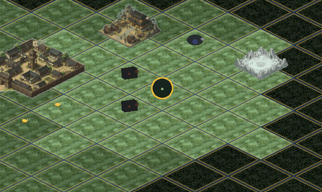

# 🌌 Taiwu Path of the Gu (太吾蛊道)

<div align="center">

[](https://unity.com/)
[](https://dotnet.microsoft.com/)
[](https://unity.com/)
[](https://github.com/)
[](https://github.com/)

*A ruthless, high-fidelity Xianxia simulation RPG combining the harsh aperture cultivation and living Gu parasite ecology of **Reverend Insanity** (蛊真人) with the procedural systemic depth of **The Scroll of Taiwu** (太吾绘卷).*

<br/>

</div>

---

## 🎬 Showcase & Gameplay Preview

<table align="center">
  <tr>
    <td align="center" width="50%">
      <b>🌌 Title Experience & Opening Sequence</b><br/>
      <sub>Seamless asynchronous bootstrapper & dynamic UI presentation</sub><br/><br/>
      
    </td>
    <td align="center" width="50%">
      <b>🗺️ Procedural Overworld & Dynamic Hexgrid</b><br/>
      <sub>Stamina-based exploration, dynamic POIs & fog-of-war traversal</sub><br/><br/>
      
    </td>
  </tr>
</table>

---

## ⚡ Core Pillars & Simulation Mechanics

### 🔮 1. Systemic Realism: Cultivation & Gu Ecology Engine
* **Aperture & Primeval Sea Capacity**: `primeval_sea_volume` is strictly bound to $[0\% - 100\%]$ and permanently capped by innate aptitude (e.g. A-Grade = $93\%$ maximum).
* **Exponential Purity Scaling**: Qualitative leaps across major cultivation ranks scale strictly exponentially:
  $$\text{Multiplier} = 80^{(\text{Rank} - 1)} \times 2^{\text{substage\_index}}$$
  *(Substages: Initial = 0, Middle = 1, Upper = 2, Peak = 3)*
* **Realistic Essence Economy**: Essence never restores magically for free. Recovery demands deliberate meditation (burning Action Points), primeval stone consumption, or specialized passive Gu abilities.
* **Living Parasite Ecology**: Gu worms possess independent satiety and starvation meters. Without regular cultivation sustenance, Gu enter critical starvation and perish permanently.

### ⏳ 2. Macro-Structure: Time as Currency & Autonomous Factions
* **Stamina & Action Economy**: Every physical overworld action consumes finite Time/Stamina units (Tile movement, aperture cleansing, Gu refining, meditation).
* **Autonomous Institutional Hierarchy**: Dynamic sect economies, territorial borders, and reputation ledgers where moral alignments trigger enforcer bounties or clan trade benefits.
* **Minimalist Procedural Aesthetics**: Clean abstract talismanic iconography, ancient seal calligraphy, and a custom real-time procedural nature audio synthesizer.

---

## 🏗️ Technical Architecture & Engineering Standards

```
┌─────────────────────────────────────────────────────────────┐
│                    Hardware & Input Router                  │
│                     (TaiwuInputRouter)                      │
└──────────────────────────────┬──────────────────────────────┘
                               │ (RaiseRequest*)
                               ▼
┌─────────────────────────────────────────────────────────────┐
│                     UI & Presentation Layer                 │
│               (Tailored Views, Modals & HUD)                │
└──────────────────────────────┬──────────────────────────────┘
                               │ (Trigger*)
                               ▼
┌─────────────────────────────────────────────────────────────┐
│                   Game Event & Domain Bus                   │
│                     (GameEventManager)                      │
└──────────────────────────────┬──────────────────────────────┘
                               │
               ┌───────────────┴───────────────┐
               ▼                               ▼
┌──────────────────────────────┐ ┌──────────────────────────────┐
│       Domain Services        │ │      GameStateContext        │
│ (Combat, Map, Economy, etc.) │ │ (Single-source-of-truth POCO)│
└──────────────────────────────┘ └──────────────────────────────┘
```

* **Zero-Allocation Architecture**: High-performance loops utilize flat struct buffers and zero-alloc PRNG (Xorshift32) to eliminate GC spikes on low-end Android devices.
* **Strict Decoupled Event Flow**: UI triggers domain requests (`RaiseRequest*`); domain services emit state updates (`Trigger*`). Zero direct cross-domain references.
* **Clean Single-Source-of-Truth**: `GameStateContext` serves as the sole POCO state container without redundant mirror DTOs.
* **Deterministic Initialization**: Strict bootstrapper ownership (`TaiwuGameBootstrapper`) with zero logic in `Awake()`/`Start()`.

---

## 🛠️ Tech Stack & Tooling

* **Engine**: Unity 6000.6.0f1 (URP - Universal Render Pipeline)
* **Language & Framework**: C# 9.0 / .NET Standard 2.1
* **Input System**: Unity New Input System + Custom Multi-Touch IMGUI Router
* **Audio Engine**: Procedural Real-time Audio Synthesis (Physical Nature Foley & Wind Field)
* **Build Target**: Android APK (ARM64) & Windows PC Standalone

---

## 📂 Project Structure

```
Taiwu Path of the Gu/
├── Assets/
│   ├── Editor/               # Custom builders, inspection suites & APK tooling
│   ├── Prefabs/              # UI templates & world POIs
│   ├── Resources/            # Audio buffers, scriptable data & balance tables
│   ├── Scenes/               # Overworld & Arena scenes
│   └── Scripts/
│       ├── Core/             # Bootstrapper, EventManager, GameStateContext
│       ├── Combat/           # Battle stage, skill resolvers & entity buffers
│       ├── Map/              # Hexgrid pathfinding, POI generators & Fog of War
│       ├── Economy/          # Market transactions, Gu trade & inventory
│       ├── Psychology/       # Cultivator mental state & NPC alignment
│       └── UI/               # Responsive HUD, Ledger, Cauldron & Touch GUIs
└── Packages/                 # URP, Input System, 2D Tilemap & Tooling
```

---

<div align="center">

*Crafted with dedication to systemic simulation depth, clean software architecture, and technical rigor.*

</div>
